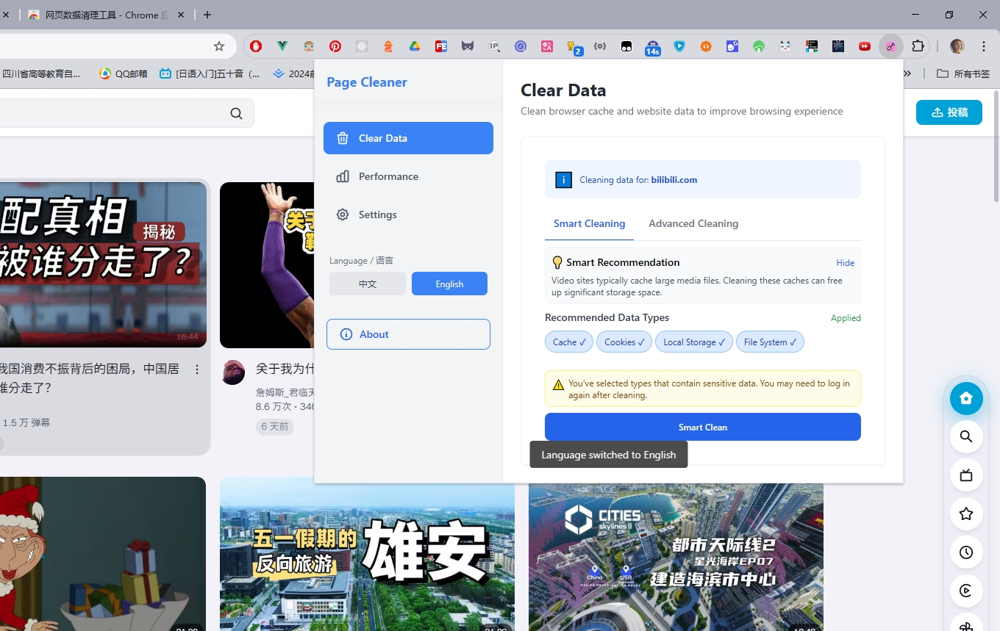

# Web Data Cleaner

[中文](./README.md) | English

A simple and efficient browser extension that helps users quickly clean cache, cookies and other browsing data for specific websites.

## ✨ Key Features

- 🎯 Precisely clean cache data for current website
- 🛡️ **Whitelist Protection** - One-click to protect Cookies of frequently used websites
- 📊 **Space Estimation** - Real-time display of estimated storage space to be freed
- 🔒 Confirmation dialog before clearing sensitive data
- ⚡ **Quick Access** - Click to clean immediately without scrolling
- 🔄 Optional auto-refresh current page
- 💪 Deep clean and quick clean modes
- 🌐 Multilingual support (English/Chinese)
- 🎨 Modern gradient design with hidden scrollbars
- 📈 Integrated performance detection to track optimization results
- ⏱️ Custom cleaning rules with instant execution
- ♿ Accessibility support (focus-visible, keyboard navigation, color contrast)
- 🧩 Unified component styles (buttons/inputs/selects/cards), responsive layout and transitions

## 📸 Product Screenshot

## 🔧 Data Types Supported

- Website cache
- Cookies
- Local storage
- Service workers
- IndexedDB databases
- SessionStorage
- WebSQL databases
- Form data
- File system storage

## 📊 Performance Metrics

- DNS lookup time
- TCP connection time
- Request/response time
- DOM parsing time
- Total page load time
- Resource count and size

## 📦 Installation

1. Clone the repository
   git clone
   cd ClearPage

2. Install dependencies
   npm install

3. Build the project
   npm run build

4. Install in your browser

- Open browser extensions management page
- Enable "Developer mode"
- Click "Load unpacked"
- Select the `dist` directory

## 💡 How to Use

1. Click the extension icon to open the panel
2. Smart cleaning recommendations are automatically applied
3. Use the select/deselect all buttons to quickly manage data types
4. Click the "Clear Data" button
5. Confirm the warning prompt for sensitive data (like cookies)
6. The page will automatically refresh after cleaning
7. Switch to "Performance" tab to view automatically executed performance analysis
8. Create and manage custom cleaning rules in the "Settings" tab

## 🔨 Development

### Tech Stack

- TypeScript + React
- Tailwind CSS
- Browser Extension API

### Commands

Development mode
npm start
Build
npm run build
Test
npm test

## ⚠️ Important Notes

- Clearing cookies will log you out of websites
- The extension only affects the currently open website
- Always verify which data types you're clearing before proceeding

## 📝 License

MIT License

## 📅 Change Log

### 2025-11-15

**UI & Usability Update**

- Popup fixed height `600px`, responsive width `520–640px` (`src/components/App.tsx:104`)
- Sidebar width reduced for better balance: `w-36/sm:w-40/md:w-44` (`src/components/App.tsx:106`)
- Sidebar labels forced single-line to prevent wrapping (`src/styles/tailwind.css:26-32`)
- Unified component styles and focus-visible accessibility (`src/styles/tailwind.css`)
- Navigation accessibility: `role="navigation"` and `aria-current` (`src/components/App.tsx:113-126`)
- Removed cleaning history feature to simplify permissions and maintenance (`src/services/historyService.ts` removed)

### 2025-11-06

**Major Update v1.0.11 - Comprehensive Optimization**

#### Core Features

- 🛡️ **New Whitelist Protection** - One-click to protect frequently used website Cookies, solving re-login issues
- 📊 **New Space Estimation** - Real-time display of estimated storage space to be freed (MB/GB)
- ⚡ **New Layout Design** - Cleaning button at top, click immediately without scrolling
- 💪 **Quick/Deep Clean Modes** - One-click switch between basic and complete cleaning

#### User Experience

- ✨ Simplified cleaning workflow, removed smart recommendations for full user control
- 🔒 Added confirmation dialog for sensitive data cleaning to prevent mistakes
- 🔄 Auto-refresh now defaults to off and only refreshes current tab (no other tabs affected)
- 👀 Hidden all scrollbars for cleaner interface
- 🎨 Completely redesigned UI with gradients, shadows, and modern animations
- 🎯 Added "Execute Now" button for settings panel rules

#### Technical Fixes

- 🔧 Fixed React 18 compatibility issue, upgraded to createRoot API
- 🔧 Fixed TypeScript type definition errors
- ⚡ Optimized component rendering performance, removed unnecessary forced re-renders
- ❌ Removed scheduled automatic cleaning to prevent accidental logout
- 📦 Unified version to 1.0.11

### 2025-05-10

- ✨ Implemented automatic performance detection when switching to performance tab
- 🚀 Optimized smart recommendations to auto-apply when opening the extension
- 📋 Added select/deselect all functionality for data types

### 2025-05-03

- ✨ Added custom cleaning rules feature for creating and managing rules
- 🔄 Optimized interface navigation with tab-based switching

### 2025-04-25

- 🎨 Optimized interface layout, increased width, and improved usability
- ✨ Improved data type display with grouping and multi-column layout
- 🚀 Enhanced buttons and interactive elements with better visual feedback

### 2025-04-22

- ✨ Added support for more data types: IndexedDB, SessionStorage, WebSQL, etc.
- 🚀 Implemented deep cleaning mode for more thorough website data removal

### 2025-04-17

- 💡 Added cleaning recommendations and one-click apply feature

### 2025-04-04

- ✨ Added display of data clearing time
- 🚀 Optimized cache clearing performance for faster operation

### 2025-02-03

- ✨ Added feature to clear browsing history for specific domains

### 2025-01-13

- ✨ Added browser i18n internationalization support

### 2025-01-12

- ✨ Added page performance detection tool
- 🐛 Fixed refresh issue after clearing Service Workers

## ⭐ Star History

